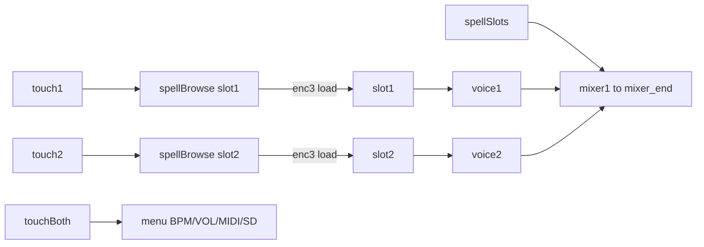

# Spell — concept

Spell is a **2-slot DJ player** product concept for the TŒRN hardware (Teensy 4.1 + 32×16 LED matrix + 4 encoders + 2 capacitive touches + SD + MIDI). It is **not** a step sequencer. The `spell` git branch exists to hold this concept and future implementation; it is not a live firmware product yet.

This document is the source of truth for UX, audio, storage, and implementation constraints.

---

## Product intent

Turn the same physical device into a dual-deck looper / DJ sketch:

- Load one long WAV into **slot 1** and another into **slot 2**
- Play both at once, mix volumes, tweak playback speed per slot
- Browse and preview songs from the SD card without a sequencer grid
- Keep the parts of TŒRN that already feel solid: boot, SD mount, encoders, MIDI clock, headphone/VOL path

Everything sequencer-shaped (grid paint, pages, fills, pattern save, synth channels, etc.) is out of scope for Spell.

---

## Hardware assumptions

| Item | Spell requirement |
|------|-------------------|
| LED matrix | **Always 2 modules** → `maxX = 32`, `maxY = 16` (LEDS=2). Persist this so UI never boots 16-wide by accident. |
| Encoders | 4 × i2cEncoderLibV2 (same addresses / interrupt pin as main) |
| Touches | Touch1 + Touch2 (capacitive); chord = both |
| Audio | SGTL5000 + existing Teensy Audio graph habits |
| Storage | BUILTIN SD; library WAVs live under **`songs/`** (create on first boot if missing) |
| MIDI | Serial8 DIN; clock in/out; BPM report/send |
| Host file transfer | USB Serial SD server (existing `toern_sd.py` / web tool) stays available to move WAVs onto the card |

---

## Modes

Three modes only:

1. **`spellSlots`** — default home (slot view)
2. **`spellBrowse`** — shared file browser, targeted at slot 1 or 2
3. **`menu`** — pruned settings (BPM, VOL, MIDI, SD)

No DRAW / SINGLE / FILTER / SET_WAV-as-product / SONG / IMG / etc. as user-facing modes.

---

## Slot view (home)

### Display (32×16)

- **Row `y == 1`**: bottom border
  - Left half (`x = 1 … mid`): **slot 1** — blue
  - Right half (`x = mid+1 … 32`): **slot 2** — violet
- Above the border: **waveform snippet** per half (from peaks captured at load / browse)
- While a slot is playing: that slot’s waveform (and/or encoder RGB) goes **green**
- Empty slot: dim `S1` / `S2` label is fine
- Optional: battery-low warning overlay (reuse existing battery path)

### Encoder map

| Encoder | Rotate | Press |
|---------|--------|--------|
| 1 | Slot 1 **speed** | Slot 1 **play / stop** |
| 2 | Slot 1 **volume** | — |
| 3 | Slot 2 **volume** | — |
| 4 | Slot 2 **speed** | Slot 2 **play / stop** |

Details:

- **Speed**: continuous playback rate via `AudioPlayArrayResmp::setPlaybackRate` (suggested UI range ~0.50×–2.00×, unity = 1.00×)
- **Volume**: per-slot gain into the mix (map onto voice 1 / voice 2 channel volume → amps / `setAmplitude`)
- Both slots may play and **sum** in the mixer
- Play/stop is **one-shot transport per slot**, not the sequencer playhead

### Touch map (from home)

| Gesture | Action |
|---------|--------|
| Touch1 | Open browser for **slot 1** |
| Touch2 | Open browser for **slot 2** |
| Touch1+2 | Enter **menu** |

---

## Browser

Shared browser UI; which slot is being filled is set when entering (`browseTarget = 1|2`).

### Behaviour

- Root directory on SD: **`songs/`** (not `samples/`)
- Create `songs/` at boot if absent
- **Enc4**: browse list + start preview of the selected WAV
- **Enc3 press**: **load** selection into the target slot’s RAM voice, capture waveform peaks, return to slot view
- **No seek / seekEnd / trim UI** — loads are full-file (within RAM budget)
- Touch1 / Touch2 again: toggle back home if already browsing that slot, or switch target slot
- Touch1+2: menu

### Preview

- Reuse SD preview path (`playSdWav1` + peak meter) for audition while browsing
- Stop preview when loading, leaving browser, or opening menu
- Do not block the UI on huge peak scans; progressive peaks are OK

### Load

- Decode WAV data chunk → EXTMEM sample buffer for voice **1** or **2**
- Refresh that slot’s peak cache for the home waveform strip
- After load: stop that slot’s playback; user presses Enc1/Enc4 to play

---

## Menu

Touch1+2 opens the existing menu **shell**, but only these top-level pages:

| Page | Role |
|------|------|
| **BPM** | Tempo + **INT / EXT** clock + brightness (same idea as today’s VOLUME_BPM screen) |
| **VOL** | MAIN, GAIN (1–4 bus + master; drop 5–8/SYN if unused), LOUT, PREV, 2-CH, SPKR, HFC |
| **MIDI** | Keep clock send mode / transport / PPQN as needed so BPM send & receive stay real |
| **SD** | USB Serial SD file server (LIST/PUT/GET/…) so a host can push WAVs into `songs/` |

Exit menu (touch or encoder back) → slot view.

### BPM / MIDI requirements

- **INT**: device is clock master; send MIDI clock at `SMP.bpm` (24 PPQN) on Serial8
- **EXT**: follow incoming MIDI clock; estimate/filter BPM; show it on the BPM page (stable indicator when locked)
- Keep battery / CrashReport / EEPROM defer-while-playing habits from main where they still apply

---

## Audio architecture

### Keep / prune

Keep a **small** sample graph:

- Voices `sound1`–`sound4` (+ envelopes / bitcrush / amps / filters / filtermixers)
- **Freeverb on all 4** (wet/dry mixers) — even if UI only uses slots 1–2
- `mixer1` → `mixer_end` → stereo → SGTL5000
- Preview: `sound0` and/or `playSdWav1`
- `AudioAnalyzePeak` for waveforms / optional output meter

Slots map to voices **1 and 2**. Voices 3–4 stay in the graph for headroom / FX consistency unless later used.

### Cut (for a real Spell firmware)

- Synths 11 / 13 / 14
- Sample bank UI for ch 5–8 as product features
- Sequencer `note[][]`, pages, fills, pattern load/save
- FIRE / IMG / EYES / SONG / SETT / RECS / DAT / KIT / WAV-as-sequencer-menu, filter UI, record, child lock, pong, etc.

### Speed

Wire encoder speed → `setPlaybackRate` on the slot’s `AudioPlayArrayResmp`. Interpolation on.

---

## Storage & host workflow

```
SD card
└── songs/
    ├── track_a.wav
    └── track_b.wav
```

- Device browses only `songs/` for Spell loads
- Host uses SD serial tool (`standalone-tools/sd-tool-standalone/toern_sd.py` or web UI) to `mkdir songs` and `put` WAVs
- Prefer simple filenames on-card (spaces work if the tool escapes them; underscore names are safer)

---

## Implementation principles (hard lessons)

These are part of the concept because ignoring them produced a broken device:

1. **Reuse original boot and I/O first**  
   Startup animation, `drawNoSD` / SD wait, encoder ISR + `checkEncoders` / touch debounce, LED power pin, CrashReport — keep working code paths. Do not rewrite the board bring-up.

2. **Do not leave the sequencer home path half-alive**  
   If home is Spell slots, encoder rotation must **not** still drive `GLOB.x` / `GLOB.y` / page cursor. That causes a visible cursor, lag, and “nothing works” while Spell drawing fights DRAW logic.

3. **I2C budget**  
   Do not write encoder RGB every frame. Update RGB on state changes only. Same for unnecessary `writeMin`/`writeMax` thrash.

4. **LEDS=2 is mandatory**  
   Force and persist 2-module mode on Spell builds.

5. **Overlay vs strip**  
   Preferred long-term: a lean Spell firmware on a branch.  
   Acceptable approach: thin overlay on main **only if** DRAW/cursor/sequencer paths are fully gated off on home. A partial overlay is worse than no Spell.

6. **Versioning**  
   Spell firmware versions should use a clear prefix, e.g. `vSpell.01a`.

---

## Suggested architecture (when implementing)



**Files likely involved (when coded):**

- `toern.ino` — modes, loop, touches, encoder map, boot
- `toern_sample.ino` / helpers — `songs/` browser, preview, load, peaks
- `toern_menu.ino` — BPM / VOL / MIDI / SD only
- `toern_midi.ino` — clock send/receive, BPM estimate
- `toern_sd_serial.ino` — host WAV transfer
- `toern_ui.ino` — slot borders + dual waveforms
- `audioinit.h` — pruned 4-voice + reverb-all-4 + preview + peaks

---

## Out of scope

- Beatmatching / sync lock between slots
- EQ, cue points, loops-within-file, playlist engine
- Pattern sequencer compatibility on the Spell product build
- Keeping the full main-menu surface “just in case”

---

## Acceptance checklist (for a future first flash)

- [ ] Boot: animation + SD check; matrix is 32×16
- [ ] Home: blue/violet borders, no sequencer cursor
- [ ] Enc1/4 press play/stop; rotate speed; Enc2/3 volume; dual play mixes
- [ ] Touch1/2 browse `songs/`; Enc4 preview; Enc3 load returns home
- [ ] Touch1+2 menu: BPM (INT/EXT + send/receive), VOL, MIDI, SD
- [ ] Host can PUT WAVs into `songs/` over USB serial
- [ ] No 7-blink / encoder I2C death under normal use
- [ ] Lag feels comparable to main on home (no per-frame encoder RGB spam)

---

## Status

Concept only on branch `spell`. No Spell product firmware is checked in; mainline TŒRN sequencer firmware remains the device software until Spell is implemented deliberately against this doc.
