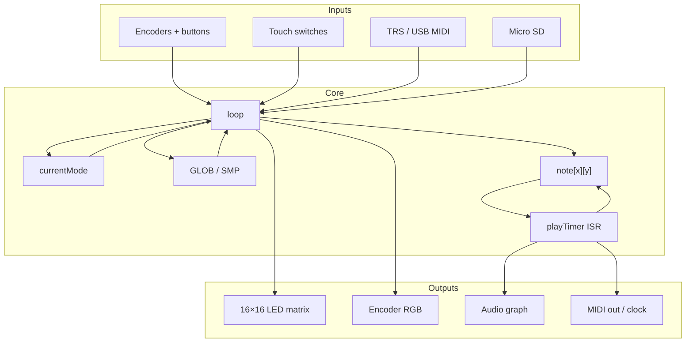

# Architecture overview

TŒRN is a single Teensy sketch that behaves like a small OS for a sampler-sequencer: a **mode machine** drives the UI, a **note grid** is the musical source of truth, **IntervalTimers** advance playback, and the **Teensy Audio library** renders sound.

## Mental model in one paragraph

You edit a 2D grid of `Note` cells (step × pitch/row). Playback walks the X axis on a timer interrupt and triggers sample or synth voices through the Audio graph. The UI never owns music data directly — it mutates `note[][]`, `GLOB`, and `SMP`, then redraws LEDs to mirror that state. Modes (`DRAW`, `FILTERMODE`, `MENU`, …) only change which encoder axes mean what and what `loop()` draws.

## Runtime pillars

### 1. Mode machine

`Mode *currentMode` points at a struct with name, encoder min/max/pos, and knob colors. Switching modes (`switchMode`) rebinds encoder hardware to those ranges. See [Modes](../core/modes).

### 2. Pattern + session state

- `note[x][y]` — packed note events for the loaded pattern (in EXTMEM)  
- `Device SMP` — BPM, samplepack/paths, filter/synth params, mutes, song arrangement  
- `GlobalVars GLOB` — cursor, channel, page, velocity, copy state, …

See [Data model](../core/data-model).

### 3. Timing

`IntervalTimer playTimer` calls playback logic in an ISR so the sequencer keeps running during SD/UI stalls. Heavy work (Serial, I2C, SD, FastLED) is deferred to `loop()` via flags. See [Main loop](./main-loop).

### 4. Audio graph

Declared in `audioinit.h`: sample players, synth oscillators, envelopes, bitcrushers, filters, freeverb, mixers → SGTL5000. Parameters are applied from filter/synth setting arrays. See [Audio graph](../audio/graph).

## Channel map (quick)

| Channels | Engine |
|----------|--------|
| 1–8 | Sample voices (`AudioPlayArrayResmp`) |
| 11 | 3-voice poly synth |
| 13–14 | Mono synths (LFO / arp capable) |

Details: [Channels](../core/channels).

## Where to change things

| You want to… | Start in… |
|--------------|-----------|
| Change what a knob does in a screen | Mode defs + handlers in `toern.ino`, UI in `toern_ui.ino` / `toern_filterUI.ino` |
| Change how notes play | Playback / `playNote` path in `toern.ino` |
| Change sound routing or FX order | `audioinit.h` + `toern_filter.ino` / `toern_parameters.ino` |
| Change menu pages | `toern_menu.ino` |
| Change MIDI / clock | `toern_midi.ino` |
| Change sample load/browse | `toern_sample.ino` + `toern_helpers.ino` |
| Change LED drawing primitives | `toern_ui.ino` / `toern_leds.ino` |
