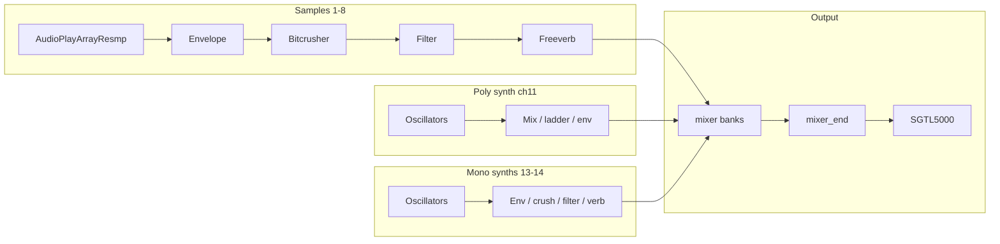

# Audio graph

The Teensy Audio design lives in [`audioinit.h`](https://github.com/Soundpauli/toern/blob/main/audioinit.h): object declarations plus `AudioConnection` patch cords. Open it like a schematic.

## High-level signal flow

Exact node names differ per channel (`sound1`, `envelope1`, `bitcrusher1`, … and synth-side `Swaveform*`, `Senvelope*`, `Sladder*`).

## Why some objects are `EXTMEM`

Large Audio objects and mixers are annotated `EXTMEM` so their state lives in PSRAM. That is a deliberate RAM1 conservation strategy — see [Memory](../contributing/memory).

## Custom nodes in `src/`

| Component | Why it exists |
|-----------|----------------|
| `resamplerReader.h` | Variable-rate / interpolated playback beyond stock players |
| `effect_freeverb_dmabuf` | Freeverb buffers placed in DMAMEM for Teensy 4.1 |

`toern.ino` includes `src/effect_freeverb_dmabuf.h` and sets `FASTLED_ALLOW_INTERRUPTS 0` so LED updates don’t fight the audio ISR world.

## Changing the graph

1. Edit objects/connections in `audioinit.h` (Arduino Audio System Design Tool exports are a common starting point).  
2. Update any pointers/arrays in filter/synth code that assume channel → object mapping.  
3. Revisit mixer gain constants (`GAIN_*`, `MIX_*`) so summed voices don’t clip.  
4. Test with multiple simultaneous sample hits + synths — headroom bugs show up under load, not silence.
