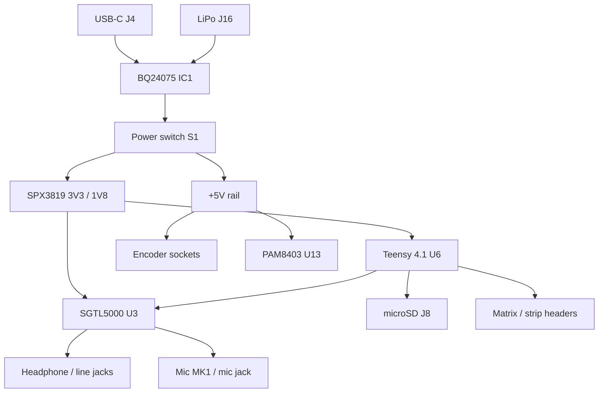

# Hardware overview — toern_revG

Current production-oriented board lives in [`PCB/toern_revG/`](https://github.com/Soundpauli/toern/tree/main/PCB/toern_revG). These pages document the **design files and electrical architecture**, not how to play the device (that’s the [handbook](https://github.com/Soundpauli/toern/tree/main/handbook)).

## What rev G is

A custom carrier that mounts a **Teensy 4.1**, integrates an **SGTL5000** codec path (same role as the Teensy Audio Board), and brings out front-panel I/O with **JST** interconnects so the usual build avoids soldering the harness.

| Area | On-board parts (high level) |
|------|-----------------------------|
| MCU | Teensy 4.1 (`U6`) |
| Audio codec | SGTL5000 (`U3`) |
| Power | USB-C (`J4`), BQ24075 charger (`IC1`), EG2219 switch (`S1`), SPX3819 LDOs, TPS22918 load switch |
| Storage | microSD (`J8`) |
| User I/O | 6.35 mm jacks, 3.5 mm MIDI TRS, mic, encoder / expansion JST headers |
| Speaker amp | PAM8403 (`U13`) optional speaker path |

Board stackup: **4-layer**, **1.6 mm** (`F.Cu` / `In1.Cu` / `In2.Cu` / `B.Cu`).

## Files in `PCB/toern_revG/`

| Path | Role |
|------|------|
| [`toern_revG.kicad_pro`](https://github.com/Soundpauli/toern/blob/main/PCB/toern_revG/toern_revG.kicad_pro) / `.kicad_sch` / `.kicad_pcb` | KiCad 7+ project (schematic + layout) |
| [`schematic.pdf`](https://github.com/Soundpauli/toern/blob/main/PCB/toern_revG/schematic.pdf) | Plot of the schematic |
| [`Gerber/`](https://github.com/Soundpauli/toern/tree/main/PCB/toern_revG/Gerber) | Gerber + drill export |
| [`jlcpcb/`](https://github.com/Soundpauli/toern/tree/main/PCB/toern_revG/jlcpcb) | JLCPCB-oriented gerbers, BOM, CPL |
| `LIB_*`, `TPS22918DBVR/`, `SJ1-3533/` | Local footprints / symbols for key parts |
| `toern_revG-backups/` | KiCad autosave archives |
| Older `toern_revF_*` copies | Historical leftovers inside the rev G folder |

Also in `PCB/`: `toern_revF/` (previous revision) and `backups/`.

## Block diagram

## License

Hardware design files are **[CC BY-NC 4.0](https://creativecommons.org/licenses/by-nc/4.0/)** — personal / non-commercial use and modification. Commercial hardware use needs written consent (see root README).

## Next

- [Connectors & pinouts](./connectors) — jacks and JST headers as laid out  
- [Power](./power) — USB, battery, rails, load switch  
- [Firmware pin map](./firmware-pins) — how `toern.ino` matches the board  
- [Fabrication](./fabrication) — ordering from Gerbers / JLCPCB exports
