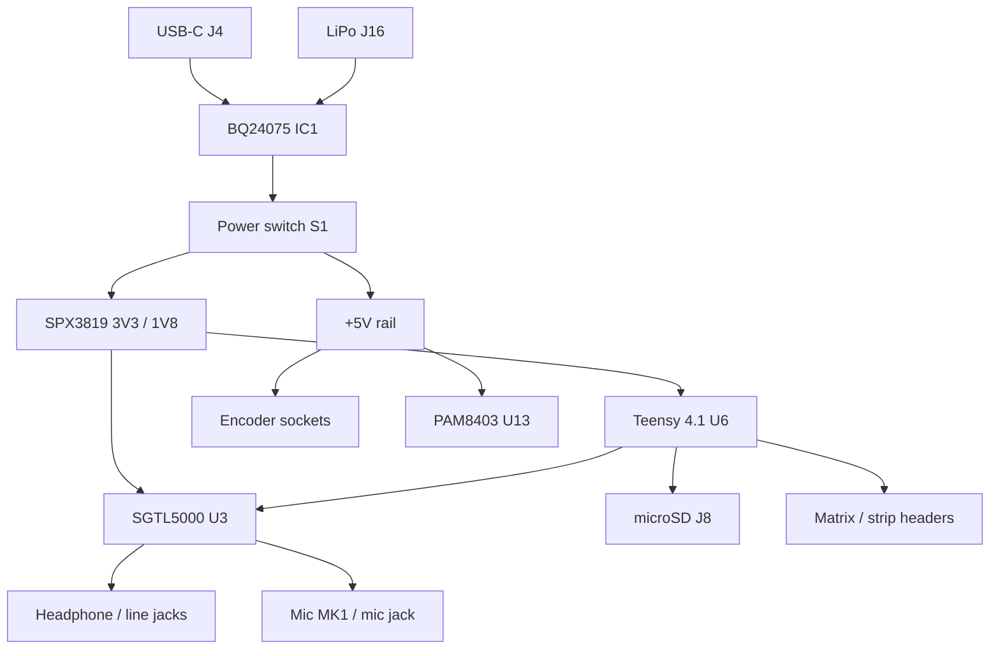

# Hardware overview — toern_revH

Current board lives in [`PCB/toern_revH/`](../../../PCB/toern_revH/). Ordering, the off-board shopping list, and first power-up are in the repo-root [BUILD.md](../../../BUILD.md). These pages are the electrical map, not how to play the device (that’s the [handbook](../../../handbook/index.html)).

## What rev H is

A custom carrier that mounts a **Teensy 4.1** and an **SGTL5000** codec, and brings the panel I/O out on **JST** headers. Jacks, sockets, and the power switch are through-hole; the shopping list is in [BUILD.md](../../../BUILD.md).

| Area | On-board parts (high level) |
|------|-----------------------------|
| MCU | Teensy 4.1 (`U6`) |
| Audio codec | SGTL5000 (`U3`) |
| Power | USB-C (`J4`), BQ24075 charger (`IC1`), EG2219 switch (`S1`), SPX3819 LDOs, TPS22918 load switch |
| Storage | microSD (`J8`) |
| User I/O | 6.35 mm jacks, 3.5 mm MIDI TRS, mic, encoder / expansion JST headers |
| Speaker amp | PAM8403 (`U13`) optional speaker path |

Board stackup: **4-layer**, **1.6 mm** (`F.Cu` / `In1.Cu` / `In2.Cu` / `B.Cu`).

## Files in `PCB/toern_revH/`

| Path | Role |
|------|------|
| [`toern_revH.kicad_pro`](../../../PCB/toern_revH/toern_revH.kicad_pro) / `.kicad_sch` / `.kicad_pcb` | KiCad project (schematic + layout) |
| [`schematic.pdf`](../../../PCB/toern_revH/schematic.pdf) | Plot of the schematic |
| [`Gerber/`](../../../PCB/toern_revH/Gerber) | Gerber + drill export |
| [`jlcpcb/`](../../../PCB/toern_revH/jlcpcb) | JLCPCB-oriented gerbers, BOM, CPL |
| [`teensy/teensy.kicad_sym`](../../../PCB/toern_revH/teensy/teensy.kicad_sym) | Teensy 4.1 symbol, vendored so the schematic opens off this repo |
| `LIB_*`, `TPS22918DBVR/`, `SJ1-3533/` | Local footprints / symbols for key parts. The `LIB_*` trees also contain unused EasyEDA / Eagle / Altium exports |
| `toern_revH-backups/` | KiCad autosave archives |

## Block diagram

```mermaid
flowchart TB
  USB[USB-C J4] --> CHG[BQ24075 IC1]
  BAT[LiPo J16] --> CHG
  CHG --> SW[Power switch S1]
  SW --> LDO[SPX3819 3V3 / 1V8]
  SW --> FIVE[+5V rail]
  LDO --> MCU[Teensy 4.1 U6]
  LDO --> CODEC[SGTL5000 U3]
  FIVE --> ENC[Encoder sockets]
  FIVE --> AMP[PAM8403 U13]
  MCU --> CODEC
  MCU --> SD[microSD J8]
  MCU --> LED[Matrix / strip headers]
  CODEC --> HP[Headphone / line jacks]
  CODEC --> MIC[Mic MK1 / mic jack]
```

## License

Hardware design files are **[CC BY-NC 4.0](https://creativecommons.org/licenses/by-nc/4.0/)** — personal / non-commercial use and modification. Commercial hardware use needs written consent (see root README).

## Next

- [Connectors & pinouts](./connectors) — jacks and JST headers as laid out  
- [Power](./power) — USB, battery, rails, load switch  
- [Firmware pin map](./firmware-pins) — how `toern.ino` matches the board  
- [Fabrication](./fabrication) — ordering from Gerbers / JLCPCB exports
