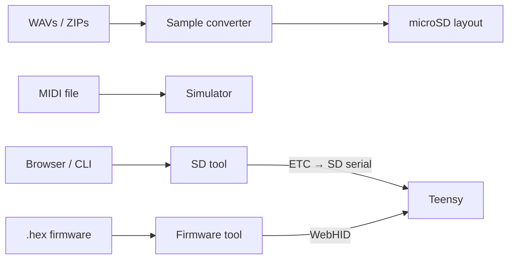

# Tools overview

Besides the firmware and PCB, the repo ships **browser and CLI tools** for samples, patterns, SD files, firmware flashing, and docs imagery.

## Public / hosted

| Tool | URL | Source |
|------|-----|--------|
| Sample converter | [audioconvert.tyng.app](https://audioconvert.tyng.app/) | `standalone-tools/audio-converter-standalone/` |
| SD tool | [sdtool.tyng.app](https://sdtool.tyng.app/) | `standalone-tools/sd-tool-standalone/` |
| Browser simulator | [sim.tyng.app](https://sim.tyng.app/) | `standalone-tools/web-standalone/` |
| Firmware tool | [firmware.tyng.app](https://firmware.tyng.app/) | `standalone-tools/teensyloader-standalone/` (GPL-3.0) |
| Color scheme editor | [toern.live/tools/colorsheme/](https://toern.live/tools/colorsheme/) | `tools/colorsheme/` |
| Case generator (demo) | [toern.live/tools/case-generator/](https://toern.live/tools/case-generator/) | `tools/case-generator/` |

## Local / contributor helpers

| Tool | Path | Role |
|------|------|------|
| SD CLI | `standalone-tools/sd-tool-standalone/toern_sd.py` | Scripted list/put/get over USB serial |

## How they relate to the device

Operator-facing how-to stays in the **handbook**; these pages describe **what each tool is, where the code lives, and how to run or extend it**.

## Next

- [Sample converter](./sample-converter)  
- [SD tool](./sd-tool)  
- [Firmware loader](./firmware-loader)  
- [Color scheme editor](./color-scheme)
