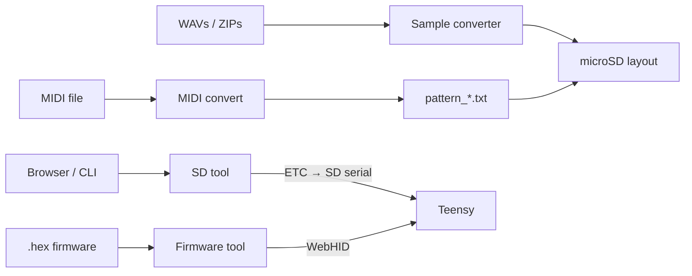

# Tools overview

Besides the firmware and PCB, the repo ships **browser and CLI tools** for samples, patterns, SD files, firmware flashing, and docs imagery.

## Public / hosted

| Tool | URL | Source |
|------|-----|--------|
| Sample converter | [audioconvert.tyng.app](https://audioconvert.tyng.app/) | `standalone-tools/audio-converter-standalone/` |
| SD tool | [sdtool.tyng.app](https://sdtool.tyng.app/) | `standalone-tools/sd-tool-standalone/` |
| Firmware tool | [toern.live/tools/teensyloader/](https://toern.live/tools/teensyloader/) | `tools/teensyloader/` (also under `website/tools/`) |
| Color scheme editor | [toern.live/tools/colorsheme/](https://toern.live/tools/colorsheme/) | `tools/colorsheme/` |
| MIDI → pattern | [toern.live/tools/convertmidi/](https://toern.live/tools/convertmidi/) | `tools/convertmidi/` |

## Local / contributor helpers

| Tool | Path | Role |
|------|------|------|
| SD CLI | `standalone-tools/sd-tool-standalone/toern_sd.py` | Scripted list/put/get over USB serial |
| Annotate | `tools/annotate/` | Handbook-style callout images |

## How they relate to the device

Operator-facing how-to stays in the **handbook**; these pages describe **what each tool is, where the code lives, and how to run or extend it**.

## Next

- [Sample converter](./sample-converter)  
- [MIDI convert](./midi-convert)  
- [SD tool](./sd-tool)  
- [Firmware loader](./firmware-loader)  
- [Color scheme editor](./color-scheme)  
- [Annotate](./annotate)
